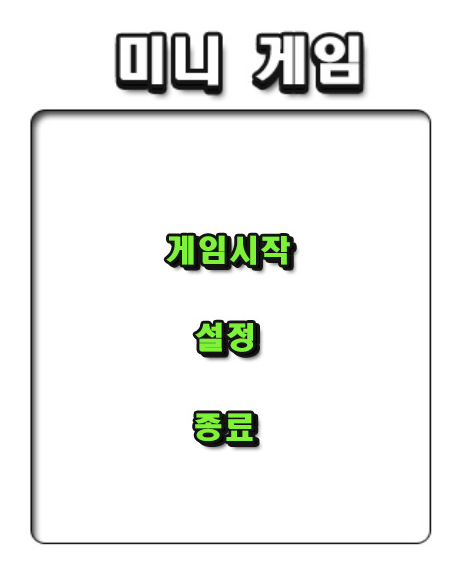
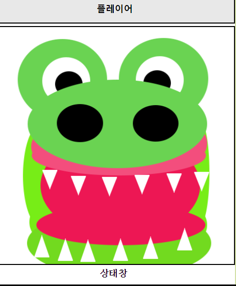
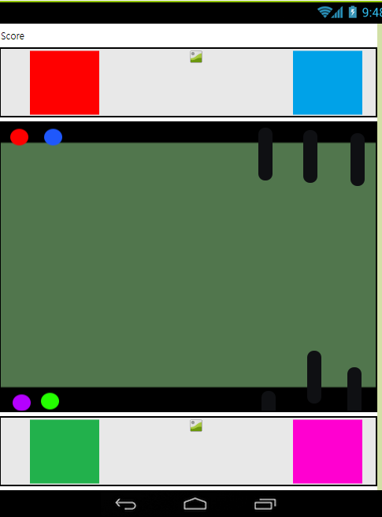
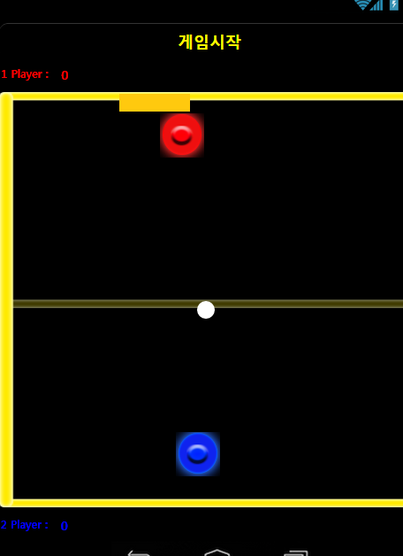

# SmartWeb_Coding
## Mit App Inventor Coding

### Hallym university Class : 창의 코딩 스마트웹
### Project Name : 미니 게임
1. 만든 목적
  + 다양한 게임을 만들어봐서 자신의 **코딩실력**을 늘리고 싶은 목적이 있다.
  + 또한 나중에 조그마한 사촌이 집에 놀러 왔을 때 놀아줄려는 마음도 있다.
2. 주요 기능
  + 4개의 동시 터치 가능한 기능. (JumpGame Screen)
  + 경쟁 혹은 복불복 시스템
3. 화면 디자인 
  
      

4. 악어이빨 게임
 + 4명이서 돌아가면서 악어 이빨을 눌러서 악어가 입을 닫으면 그 사람이 패배한다.
 
5. 점프 게임
 + 4명 동시 터치 가능하며, 오는 막대를 피해서 오래 살아남는 사람이 이긴다.
 
6. 틱텍톡
 + 2명이서 하는 게임이며, O or X 먼저 1줄 긋는 사람이 승리한다.
 
7. 하키 게임
 + 2명이서 하는 게임이며, 빨강 혹은 파랑색 원반을 이용하여 공을 골대에 넣는 사람이 승리한다.

[영상](https://www.youtube.com/watch?v=DeX5dwjEssI&feature=youtu.be)
