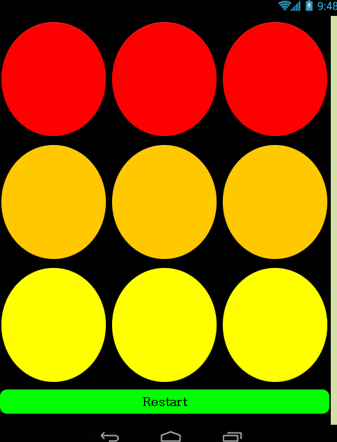

# SmartWeb_Coding
## Mit App Inventor Coding

### Hallym university Class : 창의 코딩 스마트웹
### Project Name : 미니 게임
1. 만든 목적
  + 다양한 게임을 만들어봐서 자신의 **코딩실력**을 늘리고 싶은 목적이 있다.
  + 또한 나중에 조그마한 사촌이 집에 놀러 왔을 때 놀아줄려는 마음도 있다.
2. 주요 기능
  + 4개의 동시 터치 가능한 기능. (JumpGame Screen)
  + 점수 제도
3. 화면 디자인 
  
   

[영상](https://www.youtube.com/watch?v=DeX5dwjEssI&feature=youtu.be)
